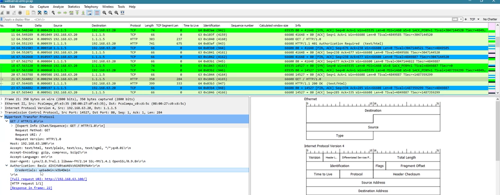

# HTTP Basic Auth

## Overview
This project documents the investigation of HTTP Basic Authentication traffic in a packet capture file.  
The objective was to analyze HTTP requests, identify how authentication was performed, and determine what sensitive information could be recovered from unencrypted traffic.

## Scenario
The investigation was based on a PCAP file containing network communication between a client and a web server.  
By reviewing the packet flow in Wireshark, it was possible to identify HTTP requests, observe the authentication sequence, and recover credentials transmitted through HTTP Basic Authentication.

## Objectives
- Analyze packet-level HTTP traffic in a PCAP file.
- Identify authentication-related requests and responses.
- Understand how HTTP Basic Authentication works in practice.
- Demonstrate why Basic Authentication is insecure when used without encryption.

## Tools Used
- Wireshark
- PCAP analysis
- HTTP traffic inspection
- HTTP header review
- Basic authentication analysis
- Base64 decoding concepts

## Investigation Steps

### 1. PCAP Overview
The packet capture was first reviewed to understand the overall communication flow and identify relevant network activity.  
This helped establish context before narrowing the analysis to HTTP traffic.

### 2. HTTP Request Filtering
The traffic was then filtered to isolate HTTP requests and focus on the web communication between the client and the server.  
This made it easier to identify repeated `GET` requests and examine the authentication flow in a structured way.

### 3. Authentication Analysis
The HTTP exchange showed a `401 Authorization Required` response followed by an authenticated request containing an `Authorization: Basic` header.  
Inspection of the HTTP details revealed the transmitted credentials, demonstrating that the username and password could be recovered directly from the traffic.

## Key Findings
- HTTP Basic Authentication credentials can be exposed in recoverable form when HTTP is used without encryption.
- Packet captures can reveal both the authentication flow and the transmitted credentials.
- Reviewing HTTP headers is essential when investigating insecure authentication mechanisms.
- Even simple web authentication traffic can provide valuable evidence during an investigation.

## Outcome
This project strengthened my ability to inspect packet captures, analyze HTTP authentication behavior, and identify insecure credential transmission in network traffic.  
It also reinforced the importance of encrypted transport protocols when protecting authentication data.

## Skills Demonstrated
- PCAP analysis
- HTTP traffic analysis
- Authentication flow investigation
- HTTP Basic Authentication analysis
- Credential exposure identification
- Technical documentation

