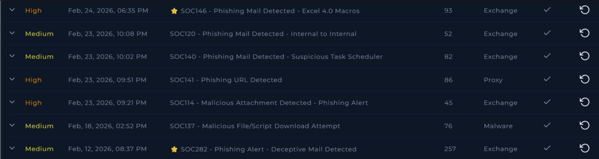
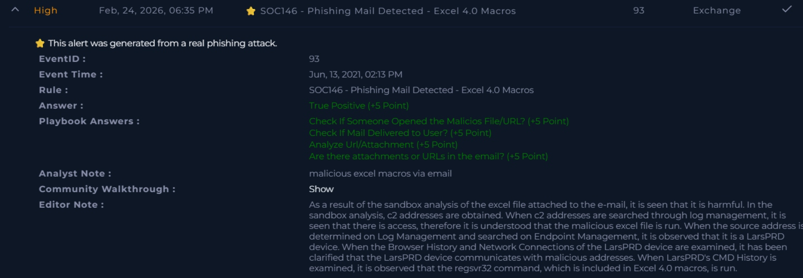

# Phishing and Malicious Documents

## Scenario
This project is based on hands-on lab activities focused on phishing investigations and malicious document analysis in a controlled environment.

It combines practice from multiple email and document-related challenges, including phishing emails, malicious Office documents, VBA-based threats, and Excel 4.0 macro abuse.

## Objective
The goal was to investigate suspicious emails and files, identify malicious indicators, understand the delivery technique, and improve my analysis workflow.

## Tools Used
- Email analysis workflow
- Browser-based investigation
- VirusTotal
- Static analysis concepts
- Basic document and macro analysis

## What I Did
- Reviewed phishing-related scenarios and suspicious email content
- Investigated malicious attachments and document-based threats
- Analyzed techniques such as malicious VBA, malicious Office documents, and Excel 4.0 macros
- Focused on identifying suspicious behavior, delivery methods, and possible indicators of compromise
- Practiced documenting findings clearly and concisely

## Outcome
This project helped me improve my phishing investigation workflow and my understanding of malicious document-based attacks in a lab environment.

## Skills Demonstrated
- Phishing email analysis
- Malicious document analysis
- Threat investigation
- Indicator identification
- Technical documentation
