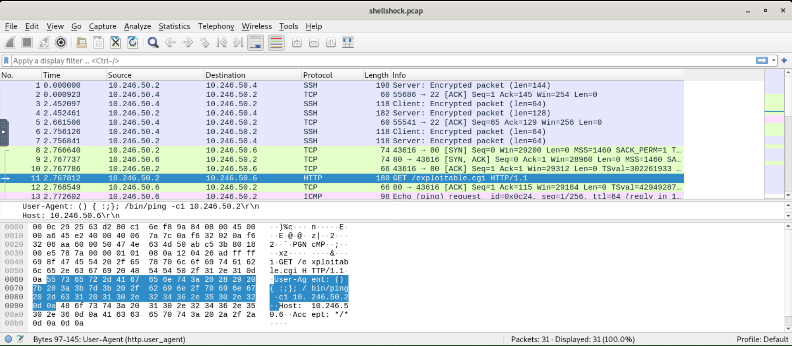

# Shellshock Attack

## Overview
This project documents the investigation of suspicious HTTP traffic associated with a Shellshock-style attack observed in a lab environment.  
The objective was to analyze packet-level evidence, identify malicious request patterns, and understand how attacker-controlled input can be used to target vulnerable web server components.

## Scenario
The investigation was based on packet capture analysis in a network-focused incident investigation context.  
By reviewing HTTP requests, headers, and server-related details, it was possible to identify behavior consistent with a web exploitation attempt.

## Objectives
- Analyze suspicious HTTP traffic in a PCAP file.
- Identify request patterns associated with a Shellshock-style attack.
- Review HTTP headers and other exposed server details.
- Reconstruct the attacker’s activity from packet-level evidence.

## Tools Used
- Wireshark
- PCAP analysis
- HTTP traffic inspection
- Header analysis
- Manual investigation of suspicious requests

## Investigation Steps

### 1. Traffic Review
The packet capture was reviewed to isolate HTTP traffic and identify unusual requests targeting the web server.  
Particular attention was given to request structure, headers, and user-controlled input delivered through HTTP.

### 2. Suspicious Request Analysis
The investigation identified an HTTP request to `/exploitable.cgi` containing a malicious payload in the `User-Agent` header.  
The payload included Shellshock-style syntax and a `/bin/ping` command, indicating an attempt to trigger command execution through a vulnerable CGI component.

### 3. Server and Protocol Observations
Additional review of the HTTP exchange provided useful context about the target service and how the communication was handled.  
This helped place the suspicious activity within the broader attack flow observed in the capture.

## Key Findings
- Packet captures can reveal exploit attempts through abnormal or crafted HTTP requests.
- HTTP header analysis can expose useful technical details about a target environment.
- Malicious web activity can often be reconstructed from network evidence alone.
- Careful inspection of request content is essential when investigating web exploitation attempts.

## Outcome
This project strengthened my ability to analyze PCAP data, inspect HTTP traffic, and recognize exploit-related patterns during an investigation.  
It also improved my confidence in documenting web attack activity from raw network evidence.

## Skills Demonstrated
- PCAP analysis
- HTTP traffic analysis
- Web attack investigation
- Shellshock-related request analysis
- Packet-level evidence interpretation
- Technical documentation

