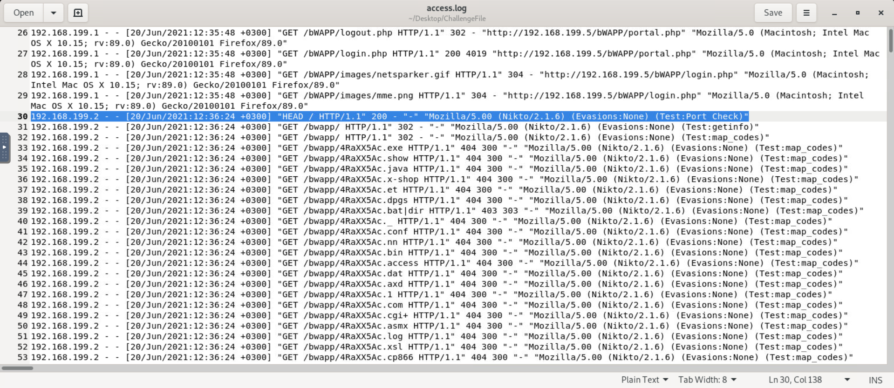
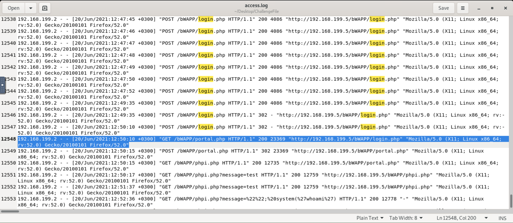
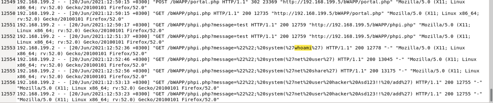

# Investigate Web Attack

## Overview
This project documents the investigation of a web attack using only the `access.log` file provided in the challenge environment.  
The analysis focused on identifying the attacker’s behavior, reconstructing the attack sequence, and determining the techniques used against the web application.

## Scenario
The available evidence was the Apache access log from the target machine.  
By reviewing HTTP methods, requested resources, status codes, referrers, and user-agents, it was possible to reconstruct the attack chain.

## Objectives
- Identify the source of suspicious activity.
- Determine the type of web attack performed.
- Reconstruct the sequence of attacker actions.
- Highlight evidence of reconnaissance, authentication abuse, and exploitation.

## Tools Used
- Linux text editor / log viewer
- Apache access log analysis
- Manual inspection of HTTP requests and responses

## Investigation Steps

### 1. Reconnaissance
The attacker began by scanning the web application with Nikto.  
This was visible in the access log through repeated requests and the `Nikto/2.1.6` user-agent.

### 2. Authentication Abuse
The log then showed repeated `POST` requests to `/bWAPP/login.php`, suggesting brute-force or repeated login attempts.  
A change in behavior appeared when the response became `302`, followed by a successful request to `/bWAPP/portal.php`, indicating likely authenticated access.

### 3. Exploitation
After reaching the portal, the attacker accessed `/bWAPP/phpi.php` and submitted crafted parameters in the `message` field.  
The payloads included commands such as `whoami`, `net user`, and `net share`, which strongly indicate command injection attempts and post-authentication system enumeration.

## Key Findings
- The suspicious source IP performed automated reconnaissance against the web application.
- The attacker attempted repeated authentication requests against the login page.
- The HTTP response pattern suggests a successful login.
- The attacker then attempted command execution through a vulnerable application parameter.
- The attack progressed through reconnaissance, access, and exploitation stages.

## Outcome
The access log provided enough evidence to identify the attack flow without requiring additional telemetry.  
This investigation shows how valuable web server logs can be for detecting scanning activity, brute-force behavior, and command injection attempts.

## Skills Demonstrated
- Web log analysis
- HTTP request interpretation
- Attack chain reconstruction
- Detection of reconnaissance activity
- Detection of brute-force login behavior
- Identification of command injection attempts
